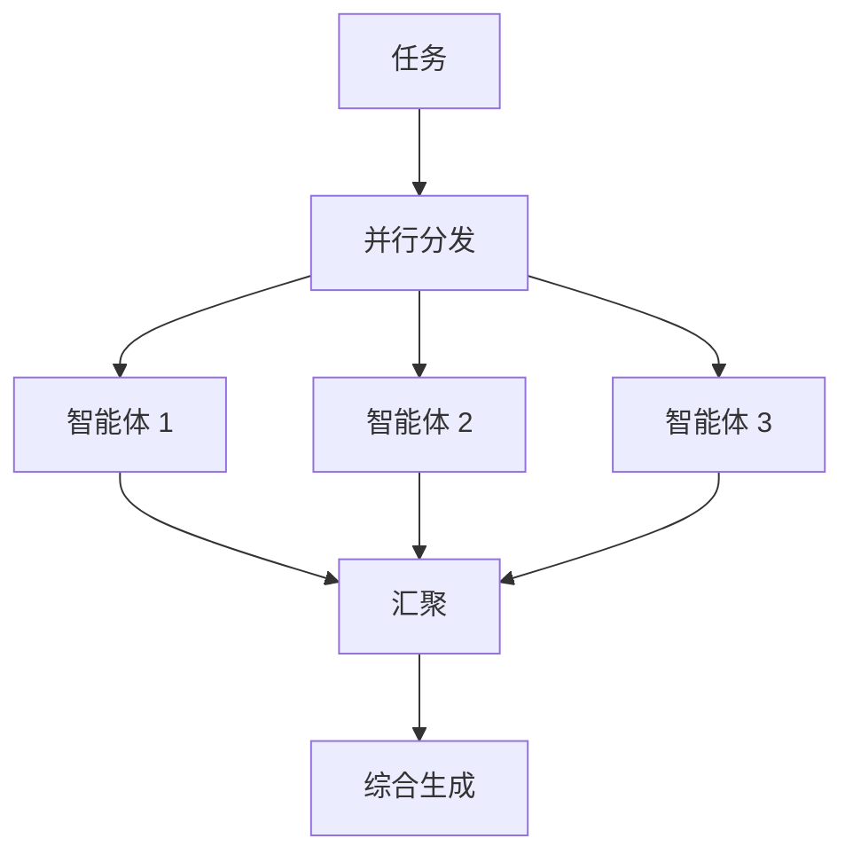
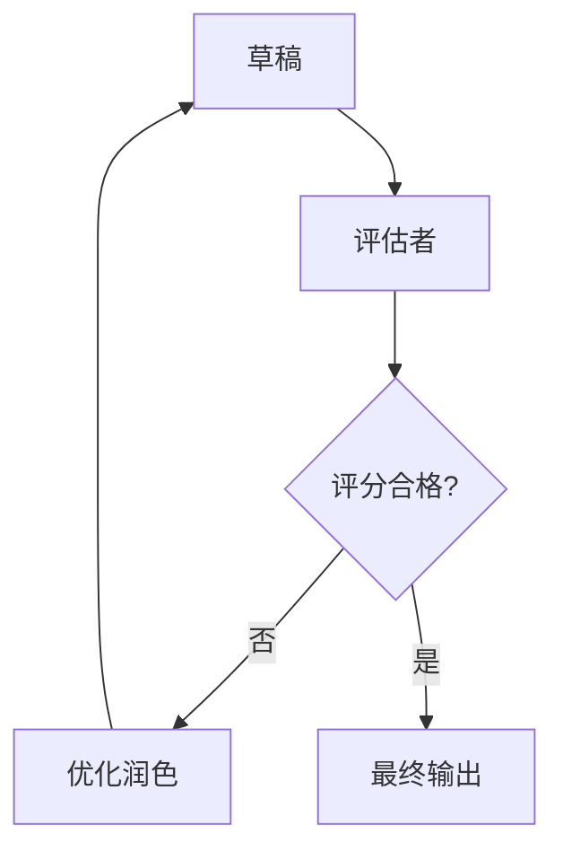

# 编排者智能体 (Orchestrator Agent)

## 目的

编排者智能体通过将任务委派给专门的智能体、协调它们的输出并确保端到端执行的连贯性来管理复杂的流水线。它是多智能体操作的主要接口。

## 智能体定义

```typescript
import { ToolLoopAgent } from "ai";
import { anthropic } from "@ai-sdk/anthropic";
import { orchestrationTools } from "../tools";

export const orchestratorAgent = new ToolLoopAgent({
  name: "orchestrator",
  model: anthropic("claude-sonnet-4-20250514"),
  instructions: `你是一位工作流编排专家。

你的角色是：
1. 分析复杂任务并将其拆解为子任务。
2. 将子任务分配给合适的专门智能体。
3. 协调智能体的输出并处理依赖关系。
4. 将结果综合为连贯的最终输出。
5. 得体地处理错误和重试。

编排原则：
- 按能力需求分解任务。
- 在可能的情况下尽量并行化执行独立操作。
- 在智能体交接过程中保持上下文的连贯性。
- 在继续下一步前验证中间输出。
- 在长时间操作期间提供清晰的状态更新。

可用的智能体：
- evaluator (评估者)：评估 LLM 输出的质量。
- researcher (研究员)：收集并综合信息。
- writer (作家)：生成并润色内容。
- analyst (分析师)：执行数据分析并提取见解。

进行委派时：
- 提供智能体所需的完整上下文。
- 指定预期的输出格式。
- 设置清晰的成功标准。`,
  
  tools: {
    delegateToAgent: orchestrationTools.delegateToAgent,
    parallelExecution: orchestrationTools.parallelExecution,
    waitForCompletion: orchestrationTools.waitForCompletion,
    synthesizeResults: orchestrationTools.synthesizeResults,
    handleError: orchestrationTools.handleError
  }
});
```

## 能力

### 任务委派 (Task Delegation)
将任务路由给专门的智能体。

**输入：**
- 智能体名称
- 任务描述
- 上下文/依赖项
- 预期输出格式

**输出：**
- 智能体响应
- 执行元数据
- 状态

### 并行执行 (Parallel Execution)
同时执行多个独立的子任务。

**输入：**
- (智能体, 任务) 的配对列表
- 超时配置

**输出：**
- 结果数组
- 每个任务的完成状态
- 遇到的任何错误

### 结果综合 (Result Synthesis)
将多个智能体的输出合并为连贯的结果。

**输入：**
- 各智能体的输出内容
- 综合指令
- 目标格式

**输出：**
- 综合后的结果
- 来源归属说明
- 置信度评估

### 错误处理 (Error Handling)
管理失败情况并实施重试逻辑。

**输入：**
- 失败的任务
- 错误详情
- 重试策略

**输出：**
- 重试后的结果，或者
- 降级方案，或者
- 错误升级上报

## 配置

```typescript
interface OrchestratorConfig {
  // 执行设置
  maxParallelTasks: number;    // 最大并行任务数
  defaultTimeout: number;      // 默认超时时间 (ms)
  retryPolicy: RetryPolicy;    // 重试策略
  
  // 质量设置
  validateIntermediateOutputs: boolean; // 是否验证中间输出
  evaluateBeforeDelivery: boolean;      // 交付前是否评估
  
  // 报告
  enableProgressUpdates: boolean;       // 是否启用进度更新
  updateFrequency: number;             // 更新频率 (ms)
}

interface RetryPolicy {
  maxRetries: number;          // 最大重试次数
  backoffMultiplier: number;   // 退避指数
  retryableErrors: string[];   // 可重试的错误类型
}

const defaultConfig: OrchestratorConfig = {
  maxParallelTasks: 5,
  defaultTimeout: 60000,
  retryPolicy: {
    maxRetries: 3,
    backoffMultiplier: 2,
    retryableErrors: ["RATE_LIMIT", "TIMEOUT", "TEMPORARY_ERROR"]
  },
  validateIntermediateOutputs: true,
  evaluateBeforeDelivery: false,
  enableProgressUpdates: true,
  updateFrequency: 5000
};
```

## 使用示例

```typescript
import { orchestratorAgent } from "./agents/orchestrator-agent";

const result = await orchestratorAgent.generate({
  prompt: `请完成以下研究和分析任务：

1. 研究当前 LLM 评估的最佳实践。
2. 分析不同评估方法之间的权衡。
3. 生成一份建议报告。
4. 评估该报告的质量。

确保最终输出内容全面，但对于技术管理者来说易于理解。`
});
```

## 编排模式

### 顺序流水线 (Sequential Pipeline)


### 并行汇总 (Parallel with Aggregation)


### 迭代优化 (Iterative Refinement)


## 集成场景

- **API 网关**：复杂请求的首要入口点。
- **任务队列**：处理长时间运行的编排任务。
- **监控系统**：跟踪多智能体的执行指标。
- **审计日志**：记录所有的委派操作和决策过程。
