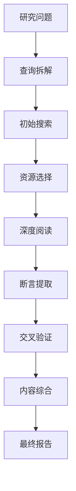

# 研究员智能体 (Research Agent)

## 目的

研究员智能体会从多个来源收集、综合并总结信息，以回答复杂的研究问题。它实现了一个包含源验证和引用跟踪的多步骤研究工作流。

## 智能体定义

```typescript
import { ToolLoopAgent } from "ai";
import { openai } from "@ai-sdk/openai";
import { researchTools } from "../tools";

export const researchAgent = new ToolLoopAgent({
  name: "researcher",
  model: openai("gpt-4o"),
  instructions: `你是一位专业的研究分析师。

你的角色是：
1. 将复杂的研究问题拆解为可搜索的查询项。
2. 从多个来源收集信息。
3. 验证并交叉核实断言 (Claims)。
4. 将研究发现综合为连贯的摘要。
5. 为所有断言提供适当的引用。

研究方法论：
- 先从广泛搜索开始以了解整体概况。
- 随后缩小至特定来源以获取详细信息。
- 尽可能始终通过多个来源验证事实。
- 区分事实、断言 (Claims) 和观点。
- 注意来源的时效性及权威性。

质量标准：
- 绝不捏造信息或来源。
- 当信息存在不确定性时需明确指出。
- 在涉及精确性时提供直接引用。
- 包含来源 URL/参考资料以便核实。`,
  
  tools: {
    webSearch: researchTools.webSearch,
    readUrl: researchTools.readUrl,
    extractClaims: researchTools.extractClaims,
    verifyClaim: researchTools.verifyClaim,
    synthesize: researchTools.synthesize
  }
});
```

## 能力

### 网页搜索 (Web Search)
在网络上搜索相关信息。

**输入：**
- 搜索查询词
- 可选：过滤器（日期、来源类型）

**输出：**
- 相关结果列表
- 摘要和 URL
- 来源元数据

### URL 网页读取 (URL Reading)
从特定 URL 提取内容。

**输入：**
- 要读取的 URL
- 内容类型（文章、论文、文档）

**输出：**
- 提取出的文本内容
- 识别出的关键章节
- 出版/发布元数据

### 断言提取 (Claim Extraction)
从来源中识别出独立的断言 (Claims)。

**输入：**
- 来源文本
- 待提取的断言类型

**输出：**
- 断言列表
- 置信度水平
- 支持性背景信息

### 断言验证 (Claim Verification)
针对其他来源交叉核实某个断言。

**输入：**
- 待验证的断言内容
- 原始来源

**输出：**
- 验证状态
- 支持或反驳的来源
- 置信度评估

### 研究综合 (Synthesis)
将多项发现整合为连贯的摘要。

**输入：**
- 研究发现内容
- 目标格式
- 需要回答的关键问题

**输出：**
- 综合后的摘要
- 关键见解
- 来源引用

## 配置

```typescript
interface ResearchConfig {
  // 搜索配置
  maxSearchResults: number;    // 最大搜索结果数
  preferredSources: string[];  // 偏好来源
  excludedDomains: string[];   // 排除的域名
  
  // 验证设置
  minSourcesForVerification: number; // 验证所需的最小来源数
  requireRecentSources: boolean;     // 是否要求最近的来源
  maxSourceAge: "1month" | "6months" | "1year" | "any"; // 来源的最大年限
  
  // 输出配置
  citationStyle: "inline (行内)" | "footnote (脚注)" | "endnote (尾注)";
  summaryLength: "brief (简短)" | "standard (标准)" | "comprehensive (全面)";
  includeSourceQuality: boolean;     // 是否包含来源质量评估
}

const defaultConfig: ResearchConfig = {
  maxSearchResults: 10,
  preferredSources: [],
  excludedDomains: [],
  minSourcesForVerification: 2,
  requireRecentSources: false,
  maxSourceAge: "any",
  citationStyle: "inline",
  summaryLength: "standard",
  includeSourceQuality: true
};
```

## 使用示例

```typescript
import { researchAgent } from "./agents/research-agent";

const research = await researchAgent.generate({
  prompt: `研究当前 LLM 评估方法的现状。

我需要了解：
1. 评估 LLM 输出的主要方法有哪些？
2. 人工评估的局限性是什么？
3. 与人工评估相比，基于 LLM 的评估者可靠性如何？
4. 实施 LLM-as-a-Judge 的最佳实践有哪些？

请提供一份带引用的详尽摘要。`
});
```

## 研究工作流



## 集成场景

- **知识库构建**：填充内部知识库。
- **事实核查**：验证生成内容中的断言。
- **市场研究**：收集竞争情报。
- **技术文档**：研究实施方案与方法。
